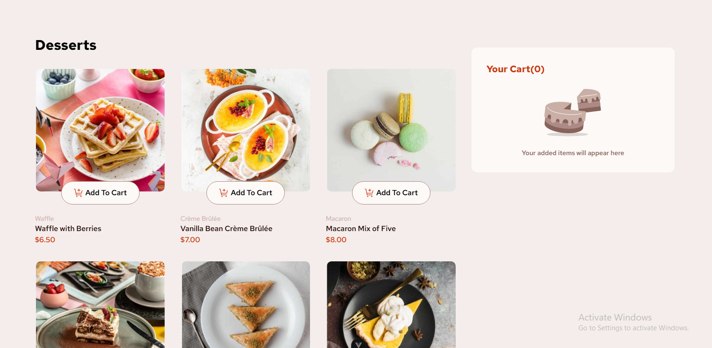

# Frontend Mentor - Product list with cart solution

This is a solution to the [Product list with cart challenge on Frontend Mentor](https://www.frontendmentor.io/challenges/product-list-with-cart-5MmqLVAp_d). Frontend Mentor challenges help you improve your coding skills by building realistic projects.

## Table of contents

- [Overview](#overview)
  - [The challenge](#the-challenge)
  - [Screenshot](#screenshot)
  - [Links](#links)
- [My process](#my-process)
  - [Built with](#built-with)
  - [What I learned](#what-i-learned)
  - [Continued development](#continued-development)
- [Author](#author)

## Overview

### The challenge

Users should be able to:

- Add items to the cart and remove them
- Increase/decrease the number of items in the cart
- See an order confirmation modal when they click "Confirm Order"
- Reset their selections when they click "Start New Order"
- View the optimal layout for the interface depending on their device's screen size
- See hover and focus states for all interactive elements on the page

### Screenshot



s

### Links

- Solution URL: [Add solution URL here](https://your-solution-url.com)
- Live Site URL: [https://products-list-theta.vercel.app/](https://products-list-theta.vercel.app/)

## My process

### Built with

- Semantic HTML5 markup
- CSS custom properties
- Flexbox
- CSS Grid
- Mobile-first workflow
- [Vue](https://vuejs.org/) - JS library
- [Pinia](https://pinia.vuejs.org/) - Vue State Management Solution
- [TailwindCss](https://tailwindcss.com/) - For styling

### What I learned

I learnt alot more about vue and Pinia when build out this challenge, I learnt about the Teleport Component that is used to 'teleport' a component into a more logical location for it in the DOM, or even outside of the application, for example having a modal actually being a direct child of the body element instead of being deeply nested in the dom. I also learnt how to apply transitions in vue using the Transition component.

```jsx
<Teleport to="body">
  <ModalContainer>
    <OrderConfirmed:cartTotal />
  </ModalContainer>
</Teleport>
```

```jsx
<div class="modal" v-if="showModal.show">
  <div class="bg-white max-w-[600px] w-[600px] md:p-8 p-4 md:rounded-2xl space-y-4 rounded-t-2xl md:h-auto">
    <slot></slot>
  </div>
</div>
```

### Continued development

I still have a few things I would like to refine in this code so I can feel comfortable with it, I have some more animations I could add like when adding a new item to the cart, removing item from the cart and of course show and hiding the modal. I would also like to clean up the code and make it neater

## Author

- Website - [My Github](https://github.com/dylan-dot-c)
- Frontend Mentor - [@dylandotc](https://www.frontendmentor.io/profile/dylandotc)
